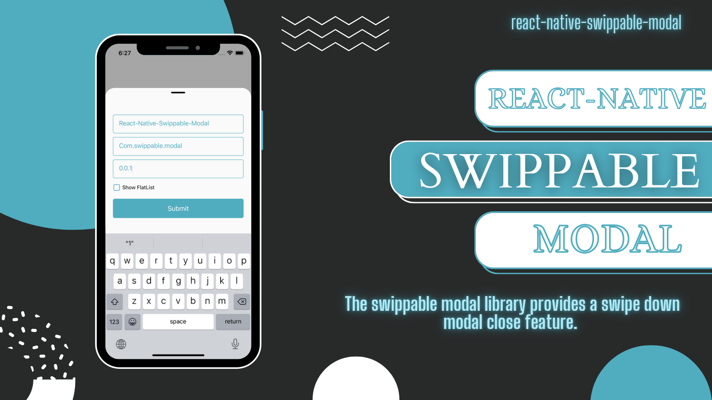

# react-native-swippable-modal

---

## [](https://www.npmjs.org/package/react-native-swippable-modal) [](https://www.android.com) [](https://developer.apple.com/ios) [](https://opensource.org/licenses/MIT)

<br>

This swippable modal library provides a swipe down modal close feature. Especially same modal contain textInput that too it worked well.

- It also provides an example app and a detailed usage overview of swippable modal
- It's fully Android and iOS compatible.

## 🎬 [Preview](./example/)

---

| <div style="width:300px"></div> Example |
| :-------------------------------------: |
|   |

## Installation

##### 1. Install swippable modal

```bash
$ npm install react-native-swippable-modal
# --- or ---
$ yarn add react-native-swippable-modal
```

##### 2. Install required dependencies

```bash
$ npm install react-native-reanimated react-native-gesture-handler
# --- or ---
$ yarn add react-native-reanimated react-native-gesture-handler
```

##### 3. Install cocoapods in the ios project

```bash
cd ios && pod install
```

> Note: Make sure to add Reanimated's babel plugin to your `babel.config.js`

```
module.exports = {
      ...
      plugins: [
          ...
          'react-native-reanimated/plugin',
      ],
  };
```

#### Usage

---

```jsx
import React, { createRef } from 'react';
import { Button, Image, TextInput, View } from 'react-native';
import {
  SwippableModal,
  SwippableModalRefType,
} from 'react-native-swippable-modal';

const exampleModalRef = createRef<SwippableModalRefType>();

const App = () => {
  return (
    <View style={{ flex: 1, alignItems: 'center', justifyContent: 'center' }}>
      <Button
        title="Open Modal"
        onPress={() => exampleModalRef.current?.show()}
      />
      <SwippableModal ref={exampleModalRef} closeThreadSoldValue={100}>
        <TextInput placeholder={'Example Input'} />
        <View style={{ height: 150, width: '100%', marginTop: 10 }}>
          <Image
            source={{
              uri: 'https://upload.wikimedia.org/wikipedia/commons/thumb/b/b6/Image_created_with_a_mobile_phone.png/800px-Image_created_with_a_mobile_phone.png',
            }}
            style={{ width: '100%', height: '100%' }}
            resizeMode={'contain'}
          />
        </View>
      </SwippableModal>
    </View>
  );
};

export default App;
```

#### Properties

---

| Props                                     | Default   | Type                     | Description                                                |
| :---------------------------------------- | :-------- | :--------------------    | :--------------------------------------------------------- |
| <strong style="color:red;">ref\*</strong> | modalRef  | reference                | It is default reference to open modal                      |
| children                                  | -         | ReactNode                | Pass children as ReactNode (Custom UI)                     |
| closeThreadSoldValue                      | 200       | number                   | It's take number value from where point modal will closed  |
| modalStyle                                | -         | ViewStyle                | Modal style                                                |
| modalBackgroundColor                      | `#FAFAFA` | `{backgroundColor: string}`| Change modal background color                              |
| disableLine                               | false     | boolean               | It's used for disable line (Hide line)                     |
| modalInnerContainerStyle                  | -         | ViewStyle             | Modal inner container style                                |
| disableClose                              | false     | boolean               | If true, modal will not close if touch out side the modal (only swipe down close allow)  |
| disableBackgroundColor                    | false     | boolean               | If pass true, it will change background color `#FFFFFF04`  |
| disableSwipeDown                          | false     | boolean               | If true, it will disable gesture swipe down close          |
| panGestureProps                           | {}        | PanGestureHandlerProp | Pan Gesture Props                                          |
| modalContainerStyle                       | -         | ViewStyle             | Modal Container style                                      |
| modalLineStyle                            | -         | ViewStyle             | Modal Line style                                           |
| showModal                                 | -         | function              | Default function to open modal                             |
| hideModal                                 | -         | function              | Default function to hide modal                             |
| panRef                                    | panRef    | reference             | Default pan reference to get pan gesture references values |

### Example

A full working example project is here [Example](./example/)

- Install dependencies in example app `cd example && yarn && cd ios/ && pod install && cd ..`
- Run example app `yarn ios`

---

## Find this library useful? ❤️

Support it by joining [stargazers](https://github.com/DhruvHarsora-FullStackDeveloper/react-native-swippable-modal/stargazers) for this repository.⭐

## 🤝 How to Contribute

We'd love to have you improve this library or fix a problem 💪
Check out our [Contributing Guide](CONTRIBUTING.md) for ideas on contributing.

## Bugs / Feature requests / Feedbacks

For bugs, feature requests, and discussion please use [GitHub Issues](https://github.com/DhruvHarsora-FullStackDeveloper/react-native-swippable-modal/issues)

### License

- [MIT License](./LICENSE)
